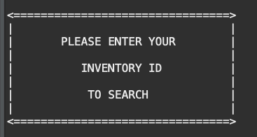

##  Aaron Cottrell
# FilmQueryProject

## Overview
Search through a database simulating a movie rental facility. Find films based on a number of search options.

## Step by Step (Short Version)
1. Choose Employee Version or Guest Version
  1a. Employee must enter ID number and Password
2. Choose search type
3. Choose search value
4. View search results
5. Choose same or different search. Option to Quit or return to Main Menu
6. View log out screen upon Quit

## Walkthrough (Long Version)

On initial program launch, the user is prompted to specify whether they are an Employee or whether they are a guest. This design is meant to simulate the differing access levels that a retail shop may offer. An employee will have more access to items than the general public. When the user chooses to enter the employee portal, they are prompted for their employee ID which must match an ID from the database which will be acknowledged with a display of their name and a prompt for their individual and unique password. The user is given 3 opportunities to input the correct password.

Incorrect entry will result in being sent back to the Main Menu. Correct password entry allows access to the Employee Search Menu. The Employee Search Menu allows for more pinpoint search results. An employee will have the ability to search by Film ID and Inventory ID which a typical guest or consumer would not have knowledge of.

When the user chooses to enter the guest portal they are presented with a basic set of search options to help them narrow their decision.

Any search will move the program into the prompt for search type option where based on the user or employee's selection from their prospective menus the display will request them for their search parameter.
 
 The program will then create a search algorithm from the user input which allows the program to sift through the database for matching data. If no data is matched in the search, the program will display that no results were found. If one or more films matched with the search the film will be displayed with associated details. The program will also keep a count of the number of search results returned.
 

 Once the search has completed the user may choose to search again, quit the program or logout (return to Welcome Screen). An employee who chooses to logout will require password entry upon re-entry into the employee portal.

 When a user chooses to Quit, the program will terminate with a goodbye message.

## Struggles

## Lessons Learned

## New Course Material
1. SQL Statements (Queries)
2. MYSQL
3. xml Files
4. Database
5. Prepared Statements
6. Connections
7. Database Accessors
8. Driver Managers
9. Result Statements
10. MAMP Server
